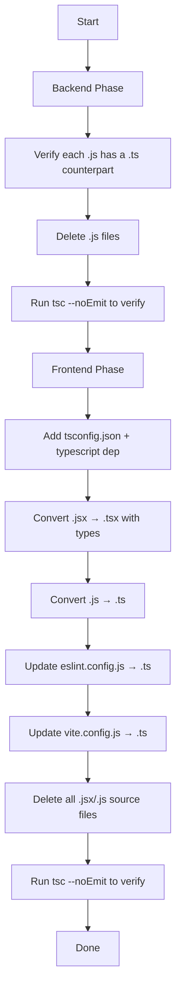

# Design Document: TypeScript Migration

## Overview

This migration completes the TypeScript transition for a full-stack application consisting of a Node.js/Express backend and a React/Vite frontend.

**Backend state**: Every `.js` module already has a paired `.ts` counterpart. The work is to delete the `.js` files and verify that `tsc` compiles cleanly.

**Frontend state**: All source files are `.jsx` (or `.js` for non-component files). The work is to create `.tsx`/`.ts` equivalents with proper type annotations, add the necessary tooling (`tsconfig.json`, `typescript` package, `@types/leaflet`), then delete the original `.jsx`/`.js` files.

The user instruction is explicit: **after changing JS files to TS, remove the JS files**. This applies to both backend (delete `.js` after confirming `.ts` exists) and frontend (delete `.jsx`/`.js` after creating `.tsx`/`.ts`).

---

## Architecture

The migration follows a two-phase approach:



No new runtime dependencies are introduced. The migration is purely a tooling and type-annotation change.

---

## Components and Interfaces

### Backend Components

The backend already has `.ts` files for every module. The components and their roles are unchanged post-migration:

| Module | Path | Role |
|---|---|---|
| Server entry | `server.ts` | Express app bootstrap, middleware registration |
| Swagger | `swagger.ts` | OpenAPI spec generation and `/api-docs` route |
| DB config | `config/db.ts` | Mongoose connection setup |
| Auth middleware | `middleWares/auth.ts` | JWT verification, attaches `req.user` |
| Models | `models/*.ts` | Mongoose schema + model definitions |
| Controllers | `controller/*.ts` | Route handler logic |
| Routes | `route/*.ts` | Express router definitions |

The auth middleware requires module augmentation to extend the Express `Request` type:

```typescript
// middleWares/auth.ts (or a separate types/express.d.ts)
declare module 'express-serve-static-core' {
  interface Request {
    user?: { id: string; role: string };
  }
}
```

### Frontend Components

#### New Configuration Files

**`frontend/tsconfig.json`** — TypeScript configuration for Vite/React:
```json
{
  "compilerOptions": {
    "target": "ES2020",
    "lib": ["ES2020", "DOM", "DOM.Iterable"],
    "module": "ESNext",
    "moduleResolution": "Bundler",
    "jsx": "react-jsx",
    "strict": true,
    "noEmit": true,
    "esModuleInterop": true,
    "skipLibCheck": true,
    "resolveJsonModule": true,
    "isolatedModules": true,
    "allowImportingTsExtensions": true
  },
  "include": ["src"]
}
```

**`frontend/vite.config.ts`** — identical logic to `vite.config.js`, just renamed:
```typescript
import { defineConfig } from 'vite'
import react from '@vitejs/plugin-react'

export default defineConfig({
  plugins: [react()],
})
```

**`frontend/eslint.config.ts`** — updated to include TypeScript-ESLint:
```typescript
import js from '@eslint/js'
import globals from 'globals'
import reactHooks from 'eslint-plugin-react-hooks'
import reactRefresh from 'eslint-plugin-react-refresh'
import tseslint from 'typescript-eslint'
import { defineConfig, globalIgnores } from 'eslint/config'

export default defineConfig([
  globalIgnores(['dist']),
  {
    files: ['**/*.{ts,tsx}'],
    extends: [
      js.configs.recommended,
      ...tseslint.configs.recommended,
      reactHooks.configs['recommended-latest'],
      reactRefresh.configs.vite,
    ],
    languageOptions: {
      ecmaVersion: 2020,
      globals: globals.browser,
    },
    rules: {
      'no-unused-vars': 'off',
      '@typescript-eslint/no-unused-vars': ['error', { varsIgnorePattern: '^[A-Z_]' }],
    },
  },
])
```

#### StoreContext Interface

The `StoreContext` must be typed with an explicit interface to satisfy Requirement 6.2:

```typescript
interface StoreContextValue {
  url: string;
  token: string | null;
  role: string | null;
  showLogin: boolean;
  setShowLogin: React.Dispatch<React.SetStateAction<boolean>>;
  updateTime: (time: string) => string;
  id: string | null;
  notifications: Notification[];
  getNotification: () => Promise<void>;
  getReport: () => Promise<void>;
  deleteNotification: (id: string) => Promise<void>;
  deleteIssue: (id: string) => Promise<void>;
  getAllReports: () => Promise<void>;
  markAsRead: (tobemarked: string, id: string) => Promise<void>;
  report: Issue[];
  allReports: Issue[];
  getUser: () => Promise<void>;
  user: Partial<User>;
  logout: () => void;
  setToken: React.Dispatch<React.SetStateAction<string | null>>;
  userName: string | null;
  setUserName: React.Dispatch<React.SetStateAction<string | null>>;
  setId: React.Dispatch<React.SetStateAction<string | null>>;
  setRole: React.Dispatch<React.SetStateAction<string | null>>;
  showSidebar: boolean;
  setShowSidebar: React.Dispatch<React.SetStateAction<boolean>>;
  theme: 'light' | 'dark';
  setTheme: React.Dispatch<React.SetStateAction<'light' | 'dark'>>;
}
```

The context is created with a typed default:
```typescript
export const StoreContext = createContext<StoreContextValue>({} as StoreContextValue);
```

#### Component Props Pattern

Every component that accepts props gets a `Props` interface:

```typescript
// Example: Notification.tsx
interface Props {
  notification: NotificationItem;
  onDelete: (id: string) => void;
}

const Notification: React.FC<Props> = ({ notification, onDelete }) => { ... }
```

Components with no props use `React.FC` with no generic or an empty interface.

---

## Data Models

### API Response Shapes (Frontend)

These interfaces are used to type `axios` response data:

```typescript
interface ApiResponse<T> {
  success: boolean;
  msg?: string;
  data?: T;
}

interface Issue {
  _id: string;
  title: string;
  description: string;
  status: 'pending' | 'in-progress' | 'resolved';
  createdAt: string;
  updatedAt: string;
  userId: string;
  image?: string;
}

interface NotificationItem {
  _id: string;
  message: string;
  isRead: boolean;
  createdAt: string;
}

interface User {
  _id: string;
  name: string;
  email: string;
  role: 'user' | 'admin';
  profileImage?: string;
}
```

### Backend Mongoose Models

Each Mongoose model uses a TypeScript interface paired with the schema:

```typescript
// Example: models/Issue.ts
import { Schema, model, Document } from 'mongoose';

export interface IIssue extends Document {
  title: string;
  description: string;
  status: 'pending' | 'in-progress' | 'resolved';
  userId: Schema.Types.ObjectId;
  image?: string;
}

const issueSchema = new Schema<IIssue>({ ... });
export const IssueModel = model<IIssue>('Issue', issueSchema);
```

### Environment Variables

Backend `process.env` accesses are typed via a helper or inline checks:

```typescript
const PORT = process.env.PORT ?? '3000';
const MONGO_URI = process.env.MONGO_URI!; // asserted present; validated at startup
```

---


## Correctness Properties

*A property is a characteristic or behavior that should hold true across all valid executions of a system — essentially, a formal statement about what the system should do. Properties serve as the bridge between human-readable specifications and machine-verifiable correctness guarantees.*

### Property 1: No legacy .js files remain in backend

*For any* file path under `/backend` (excluding `node_modules/` and `dist/`), if the file has a `.js` extension, then a `.ts` file at the same path with the `.ts` extension must not exist — meaning all `.js` files that had `.ts` counterparts have been deleted.

**Validates: Requirements 1.1, 10.1**

---

### Property 2: No legacy .jsx files remain in frontend/src

*For any* file path under `/frontend/src`, the file must not have a `.jsx` extension after migration is complete.

**Validates: Requirements 4.1, 10.2**

---

### Property 3: Orphaned .js/.jsx files are retained, not silently deleted

*For any* `.js` or `.jsx` file that has no corresponding `.ts`/`.tsx` counterpart, the file must still be present after migration and must appear in the migration report.

**Validates: Requirements 1.3, 10.3**

---

### Property 4: No .jsx extension imports remain in converted files

*For any* `.tsx` or `.ts` file under `/frontend/src`, no import statement in that file should reference a path ending in `.jsx`.

**Validates: Requirements 4.3**

---

### Property 5: All Express route handlers have explicit return type annotations

*For any* Express route handler function in the backend `.ts` files, the function must have an explicit return type annotation (e.g., `void`, `Promise<void>`, or `Response`).

**Validates: Requirements 3.1**

---

### Property 6: All Mongoose models use typed schema generics

*For any* Mongoose model definition in the backend `.ts` files, the `Schema` constructor must be parameterized with a TypeScript interface (e.g., `new Schema<IModelName>(...)`).

**Validates: Requirements 3.2**

---

### Property 7: No explicit `any` types in migrated source files

*For any* `.ts` or `.tsx` source file in the project (excluding `node_modules`, `dist`), the file must not contain an explicit `: any` type annotation. Unknown types should use `unknown` instead.

**Validates: Requirements 3.3**

---

### Property 8: All React components with props have a typed Props interface

*For any* React component function in `/frontend/src` that accepts a non-empty props argument, a `Props` interface or type alias must be defined and used as the type of that argument.

**Validates: Requirements 6.1**

---

### Property 9: StoreContext value shape is preserved after migration

*For any* key that was present in the original `StoreContext` provider value (url, token, role, showLogin, setShowLogin, updateTime, id, notifications, getNotification, getReport, deleteNotification, deleteIssue, getAllReports, markAsRead, report, allReports, getUser, user, logout, setToken, userName, setUserName, setId, setRole, showSidebar, setShowSidebar, theme, setTheme), that key must be present in the `StoreContextValue` interface and in the provider's value object after migration.

**Validates: Requirements 9.3**

---

### Property 10: API route response shapes are unchanged after backend migration

*For any* existing API endpoint, the response body shape returned after migration must be structurally equivalent to the response body shape returned before migration (same top-level keys and value types).

**Validates: Requirements 8.2**

---

## Error Handling

### Backend

- **Missing `.ts` counterpart**: Before deleting any `.js` file, the migration process checks for the `.ts` counterpart. If absent, the `.js` file is left in place and logged to a report. This prevents silent data loss.
- **TypeScript compilation errors**: If `tsc --noEmit` fails, the migration is considered incomplete. Errors are surfaced directly from the compiler output. The `dist/` directory is not updated until compilation is clean.
- **`process.env` undefined values**: Required environment variables (e.g., `MONGO_URI`, `JWT_SECRET`) are asserted with `!` or validated at startup with an explicit check that throws a descriptive error if missing.
- **`req.user` access without augmentation**: Without module augmentation, TypeScript will error on `req.user`. The augmentation declaration in `middleWares/auth.ts` (or a dedicated `types/express.d.ts`) resolves this at compile time.

### Frontend

- **Missing `typescript` package**: If `typescript` is not installed, `tsc` and Vite's type-check step will fail immediately with a clear error. The fix is `npm install -D typescript`.
- **Import path resolution after rename**: After renaming `.jsx` → `.tsx`, any import still referencing `.jsx` will cause a module-not-found error at build time. All imports must be updated to omit the extension or use `.tsx`.
- **`StoreContext` typed as `{}` default**: Using `{} as StoreContextValue` as the default context value means consuming components outside the provider will receive an empty object. This is acceptable because the app always renders within `StoreContextProvider`. A runtime guard can be added if needed.
- **`@types/leaflet` missing**: Without this package, `react-leaflet` component props will be untyped and may cause `tsc` errors. It must be added to `devDependencies`.

---

## Testing Strategy

### Dual Testing Approach

Both unit tests and property-based tests are required. They are complementary:
- Unit tests verify specific examples, integration points, and edge cases.
- Property-based tests verify universal invariants across many generated inputs.

### Property-Based Testing

The recommended PBT library for this TypeScript project is **fast-check** (works in both Node.js and browser environments, has excellent TypeScript support).

Install: `npm install -D fast-check`

Each property test must run a minimum of **100 iterations** and must be tagged with a comment referencing the design property:

```typescript
// Feature: typescript-migration, Property 1: No legacy .js files remain in backend
it('no .js files remain in backend after migration', () => {
  fc.assert(
    fc.property(fc.constant(getBackendJsFiles()), (files) => {
      return files.length === 0;
    }),
    { numRuns: 100 }
  );
});
```

#### Property Tests

| Property | Test Description | PBT Pattern |
|---|---|---|
| P1: No .js in backend | For all files in /backend (excl. node_modules, dist), none have .js extension | Invariant |
| P2: No .jsx in frontend/src | For all files in /frontend/src, none have .jsx extension | Invariant |
| P3: Orphaned files retained | For all .js/.jsx files without .ts/.tsx counterpart, file still exists | Invariant |
| P4: No .jsx imports | For all .tsx/.ts files, no import ends in .jsx | Invariant |
| P5: Handler return types | For all route handler functions, return type annotation is present | Invariant |
| P6: Typed Mongoose schemas | For all model files, Schema<T> generic is used | Invariant |
| P7: No explicit `any` | For all source files, no `: any` annotation exists | Invariant |
| P8: Props interfaces | For all components with props, a Props type is defined | Invariant |
| P9: StoreContext shape | For all expected context keys, key is present in StoreContextValue | Round-trip / Invariant |
| P10: API response shapes | For all API routes, response shape matches pre-migration shape | Model-based |

#### Unit / Example Tests

| Requirement | Test |
|---|---|
| 2.1 | `tsc --noEmit` exits with code 0 in `/backend` |
| 2.2, 2.4 | `backend/tsconfig.json` contains `strict: true`, `module: NodeNext`, `moduleResolution: NodeNext` |
| 3.4 | Module augmentation for `req.user` exists in backend source |
| 4.2 | `frontend/src/images/image.ts` exists; `image.js` does not |
| 4.4 | `frontend/tsconfig.json` exists with `jsx: react-jsx`, `strict: true`, `moduleResolution: Bundler` |
| 4.5 | `frontend/vite.config.ts` exists; `vite.config.js` does not |
| 4.6 | `frontend/eslint.config.ts` references `typescript-eslint` |
| 5.1 | `tsc --noEmit` exits with code 0 in `/frontend` |
| 5.2 | `vite build` completes without errors |
| 5.3, 7.1 | `frontend/package.json` devDependencies includes `typescript` |
| 7.2 | `frontend/package.json` devDependencies includes `@types/react` and `@types/react-dom` |
| 7.3 | `frontend/package.json` devDependencies includes `@types/leaflet` |
| 6.2 | `StoreContext` is created with `createContext<StoreContextValue>(...)` |
| 8.1 | Backend starts and MongoDB connection succeeds (integration test) |
| 8.3 | `GET /api-docs` returns HTTP 200 |
